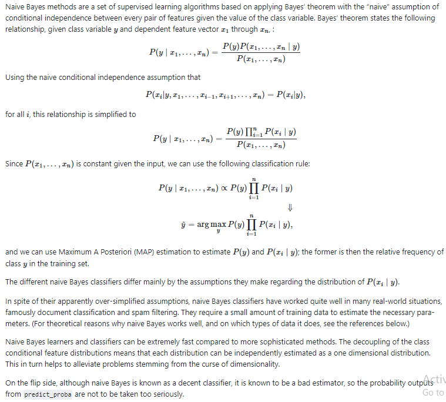

# Naive Bayes

Naive Bayes is used in classification tasks. It is a probabilistic machine learning algorithm based on the Bayes Theorem.

The name `naive` is used because it assumes that the features are independent of each other. That is changing the value of one feature, does not directly influence or change the value of any of the other features used in the algorithm.

### Pros and Cons of Naive Bayes

***Pros:***

- It is easy and fast to predict class of test data set. It also performs well in multi class prediction.
- When assumption of independence holds, a Naive Bayes classifier performs better compare to other models like logistic regression and you need less training data.
- It perform well in case of categorical input variables compared to numerical variable(s). For numerical variable, normal distribution is assumed (bell curve, which is a strong assumption).

***Cons:***

- If categorical variable has a category (in test data set), which was not observed in training data set, then model will assign a 0 (zero) probability and will be unable to make a prediction. This is often known as “Zero Frequency”. To solve this, we can use the smoothing technique. One of the simplest smoothing techniques is called Laplace estimation.

- On the other side naive Bayes is also known as a bad estimator, so the probability outputs from `predict_proba` are not to be taken too seriously.

- Another limitation of Naive Bayes is the assumption of independent predictors. In real life, it is almost impossible that we get a set of predictors which are completely independent.

  

### Applications of Naive Bayes Algorithms

- **Real time Prediction:** Naive Bayes is an eager learning classifier and it is sure fast. Thus, it could be used for making predictions in real time.
- **Multi class Prediction:** This algorithm is also well known for multi class prediction feature. Here we can predict the probability of multiple classes of target variable.
- **Text classification/ Spam Filtering/ Sentiment Analysis:** Naive Bayes classifiers mostly used in text classification (due to better result in multi class problems and independence rule) have higher success rate as compared to other algorithms. As a result, it is widely used in Spam filtering (identify spam e-mail) and Sentiment Analysis (in social media analysis, to identify positive and negative customer sentiments)
- **Recommendation System:** Naive Bayes Classifier and Collaborative Filtering together builds a Recommendation System that uses machine learning and data mining techniques to filter unseen information and predict whether a user would like a given resource or not

---

## Joint Probability

When two or more random variables are dependent on each other then the probability of an outcome cannot be calculated directly from the probability formula.

Ex: **Independent event**: Picking red/blue/green/yellow balls from a bag. **With** replacement (If we **put the ball we picked back** in the bag).

Ex: **Dependent event**: Picking red/blue/green/yellow balls from a bag. **Without** replacement (If we **do not put the ball we picked back** in the bag). Or Tossing a coin 2 times. The head/tail that occurs in the second toss does not depend on the head/tail that occurs in the first toss.

## Conditional Probability

Conditional Probability is the likelihood of an event occurring given that something has already taken place.

Ex: Probability of there being a **fire given that we see smoke**. If smoke is there then there may or may not be fire and similarly if we see fire there may or may not be smoke.